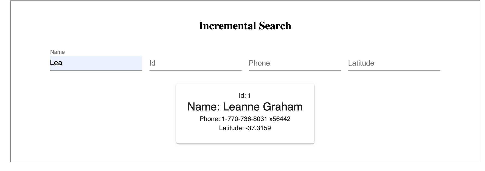

# Incremental Search

### Description

This application allows the user to search for people in a database.  
Searching should be possible using any of the fields provided in the database, 
i.e. one could search for first name and location latitude, for an ID or for a 
phone number.


The user will be presented with an empty form that contains all possible fields.
As soon as the user enters data into the form, the database will search 
for a matching entry.  If multiple entries match, the user will get information 
that there are multiple matches and the number of matches.  
If only one entry matches, that entry will be displayed below the form.
If no entries match, a message indicating that there are no matches will be 
displayed.


###### Sample screen:



### Get it running

- Install the dependences -  ``` npm install ```
- Run the application - ``` npm start ```
- Start the express server - ``` npm run start:server ```
- Run the tests - ``` npm test ```

